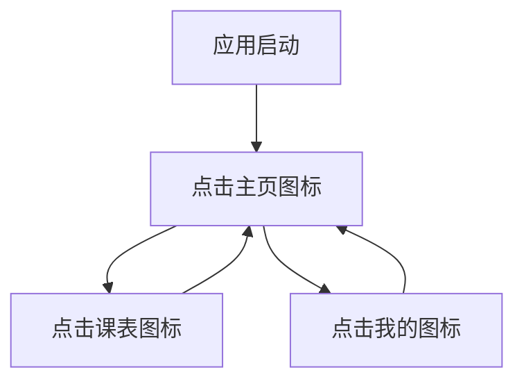

## 1. 产品概述
这是一个移动端优先的Web应用，提供简洁的底部导航体验。主要面向需要快速访问主页、课表和个人中心的用户群体，通过直观的图标导航提升移动端使用体验。

## 2. 核心功能

### 2.1 用户角色
| 角色 | 注册方式 | 核心权限 |
|------|----------|----------|
| 普通用户 | 手机号/邮箱注册 | 浏览主页、查看课表、管理个人资料 |

### 2.2 功能模块
应用包含以下主要页面：
1. **主页**：展示主要内容、推荐信息
2. **课表**：课程安排、时间表管理
3. **我的**：个人资料、设置选项

### 2.3 页面详情
| 页面名称 | 模块名称 | 功能描述 |
|----------|----------|----------|
| 主页 | 内容展示 | 显示推荐内容、最新信息、主要功能入口 |
| 课表 | 课程列表 | 展示今日/本周课程安排、课程详情查看 |
| 我的 | 个人中心 | 用户资料展示、设置选项、退出登录 |
| 底部导航 | 导航栏 | 固定底部显示、三个图标按钮、选中状态高亮 |

## 3. 核心流程
用户操作流程：
1. 用户打开应用 → 进入主页（默认选中主页图标）
2. 点击底部导航图标 → 切换对应页面内容
3. 选中状态保持 → 深蓝色高亮显示当前页面

## 4. 用户界面设计

### 4.1 设计风格
- **主色调**：深蓝色 (#1e3a8a) 用于选中状态
- **辅助色**：浅灰色 (#f3f4f6) 用于背景
- **按钮样式**：扁平化设计，圆角图标
- **字体**：系统默认字体，移动端优化字号
- **布局风格**：底部固定导航，内容区域自适应

### 4.2 页面设计概述
| 页面名称 | 模块名称 | UI元素 |
|----------|----------|--------|
| 主页 | 内容区域 | 顶部标题栏、滚动内容区、卡片式布局 |
| 课表 | 课程列表 | 时间轴展示、课程卡片、状态标识 |
| 我的 | 个人中心 | 头像区域、功能列表、设置选项 |
| 底部导航 | 导航栏 | 三个图标按钮、选中高亮、文字标签 |

### 4.3 响应式设计
- **移动端优先**：针对手机屏幕优化
- **自适应布局**：内容区域根据屏幕高度调整
- **触摸交互**：图标大小适配手指点击（最小44px）
- **安全区域**：适配不同手机的刘海和底部安全区域