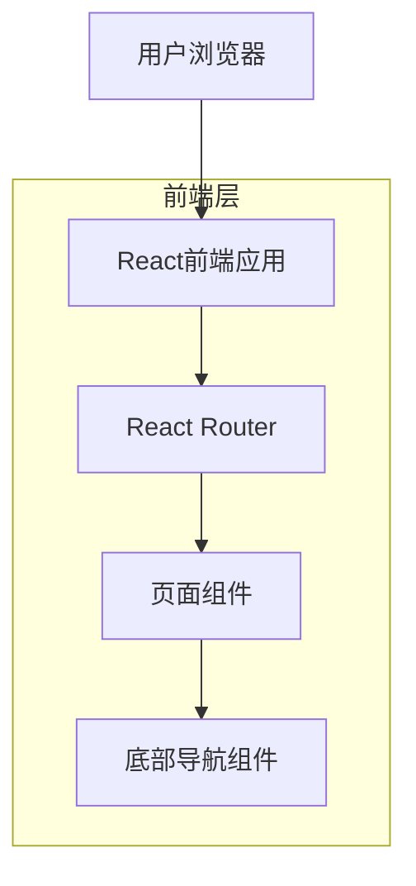

## 1. 架构设计



## 2. 技术栈描述

- **前端框架**：React@18 + Tailwind CSS@3 + Vite
- **初始化工具**：vite-init
- **路由管理**：React Router@6
- **图标库**：lucide-react（或自定义SVG图标）
- **状态管理**：React Context（轻量级状态管理）
- **后端服务**：暂无（纯前端应用）

## 3. 路由定义

| 路由路径 | 页面用途 |
|----------|----------|
| / | 主页，默认展示主要内容 |
| /schedule | 课表页面，显示课程安排 |
| /profile | 个人中心，用户资料管理 |

## 4. 组件架构

### 4.1 核心组件结构
```
src/
├── components/
│   ├── Layout/
│   │   ├── MobileLayout.jsx      # 移动端布局容器
│   │   └── BottomNavigation.jsx  # 底部导航组件
│   ├── pages/
│   │   ├── Home.jsx             # 主页组件
│   │   ├── Schedule.jsx         # 课表组件
│   │   └── Profile.jsx          # 个人中心组件
│   └── icons/
│       └── NavigationIcons.jsx   # 导航图标组件
├── contexts/
│   └── NavigationContext.jsx     # 导航状态管理
└── App.jsx                      # 应用入口
```

### 4.2 底部导航组件API

组件属性：
```typescript
interface BottomNavItem {
  id: string;
  label: string;
  icon: React.ComponentType;
  path: string;
  active: boolean;
}

interface BottomNavigationProps {
  items: BottomNavItem[];
  activeItem: string;
  onItemClick: (itemId: string) => void;
}
```

## 5. 移动端适配方案

### 5.1 视口配置
```html
<meta name="viewport" content="width=device-width, initial-scale=1.0, maximum-scale=1.0, user-scalable=no">
```

### 5.2 安全区域处理
```css
/* iOS安全区域适配 */
.padding-bottom-safe {
  padding-bottom: env(safe-area-inset-bottom);
}
```

### 5.3 触摸优化
- 图标点击区域：最小44×44像素
- 触摸反馈：active状态样式
- 防止误触：适当的间距设计

## 6. 性能优化

### 6.1 代码分割
- 路由级别的代码分割
- 组件懒加载
- 图标按需加载

### 6.2 样式优化
- Tailwind CSS的PurgeCSS功能
- 移动端优先的响应式设计
- 避免不必要的重渲染